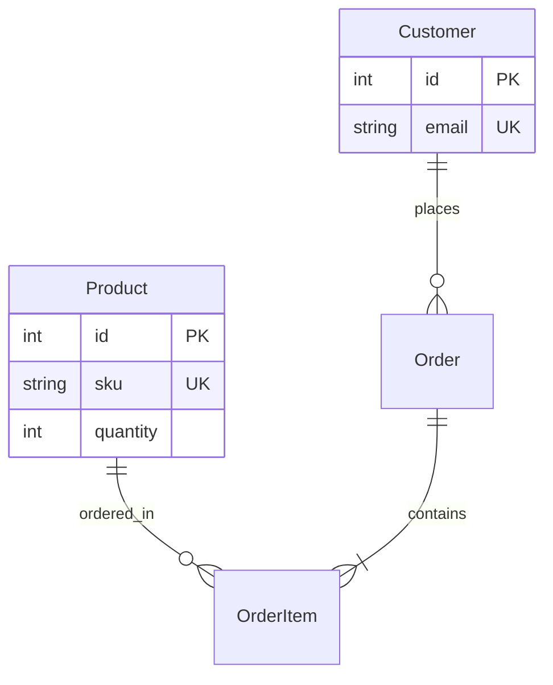

# 📦 Full-Stack Inventory & Order Management System

[](https://fastapi.tiangolo.com/)
[](https://react.dev/)
[](https://www.typescriptlang.org/)
[](https://www.postgresql.org/)
[](https://www.docker.com/)

A production-ready full-stack application built with **FastAPI**, **React (TypeScript + Vite)**, and **PostgreSQL** featuring transactional inventory stock checks, real-time metrics dashboard, and full Docker containerization.

---

## 🔗 Resources & Deployments

- 🖥️ **Live Frontend Dashboard:** [Vercel Deployment](https://inventory-order-management-system-rho.vercel.app/)
- ⚙️ **Live Backend API (Swagger):** [Render API Docs](https://inventory-backend-478w.onrender.com/docs)
- 🐙 **Source Code:** [GitHub Repository](https://github.com/Sachin7568/Inventory-Order-Management-System)
- 🐳 **Docker Hub Image:** [sachin10094/inventory-backend](https://hub.docker.com/r/sachin10094/inventory-backend)

---

## ✨ Features & Architecture

### Key Capabilities
- **Real-Time KPIs:** At-a-glance metrics for total products, customers, orders, and low-stock alerts.
- **ACID Order Transactions:** Atomically reserves product stock or rolls back on insufficient inventory. Automatically restores stock on order deletion.
- **Modern UI:** Styled using pure Vanilla CSS tokens, fully responsive, featuring clean micro-animations.

### Schema (ERD) & File Structure

```text
├── backend/app/     # FastAPI routers, models, schemas, tests (pytest)
├── frontend/src/    # React pages, components, services, styling
└── docker-compose.yml
```

---

## 🚀 Quick Start Guide

### Option 1: Using Docker (Recommended)
1. Copy environment variables: `cp .env.example .env`
2. Start containers: `docker-compose up --build`
3. Access UI at `http://localhost:3000` & Swagger Docs at `http://localhost:8000/docs`

### Option 2: Run Locally (Without Docker)
- **Backend:** Setup Python venv, install dependencies, and run uvicorn server:
  ```bash
  cd backend && python -m venv venv && source venv/bin/activate
  pip install -r requirements.txt
  uvicorn app.main:app --reload
  ```
  *(To run integration tests, execute `pytest` in the backend directory)*

- **Frontend:** Install Node dependencies and start Vite dev server:
  ```bash
  cd frontend && npm install && npm run dev
  ```

---

## 🔌 API Summary

| Endpoint | Methods | Description |
| :--- | :--- | :--- |
| `/products` | `GET`, `POST`, `PUT`, `DELETE` | Product catalogue CRUD (requires unique SKU). |
| `/customers`| `GET`, `POST`, `DELETE` | Customer registration (requires unique email). |
| `/orders` | `GET`, `POST`, `DELETE` | Transactional order processing (adjusts/restores stock levels). |
| `/health` | `GET` | API uptime check. |

---

## 🔒 Configuration

| Environment Variable | Default Value | Usage |
| :--- | :--- | :--- |
| `DATABASE_URL` | `sqlite:///./sql_app.db` | SQLAlchemy connection URI (PostgreSQL or SQLite). |
| `VITE_API_URL` | `http://localhost:8000` | Target endpoint for frontend requests. |

---

## ☁️ Deployment Quick Checklist

1. **Database:** Deploy a Postgres database on **Neon** and retrieve the connection URI.
2. **Backend:** Deploy on **Render** (Root: `backend`, Env: `Docker`). Set environment variable `DATABASE_URL`.
3. **Frontend:** Deploy on **Vercel** (Root: `frontend`, Preset: `Vite`). Set environment variable `VITE_API_URL` to Render backend URL.
